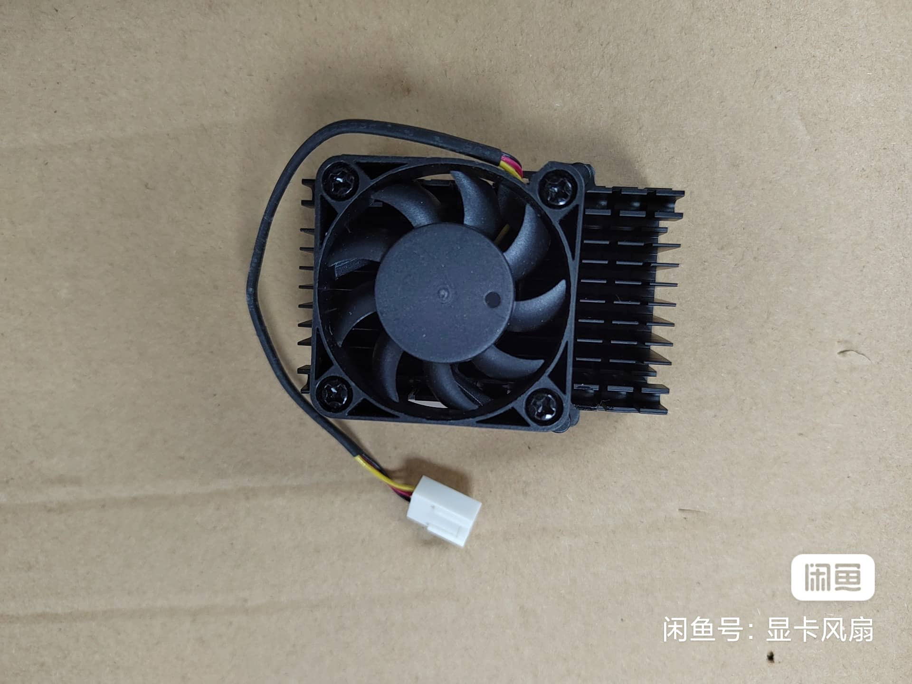
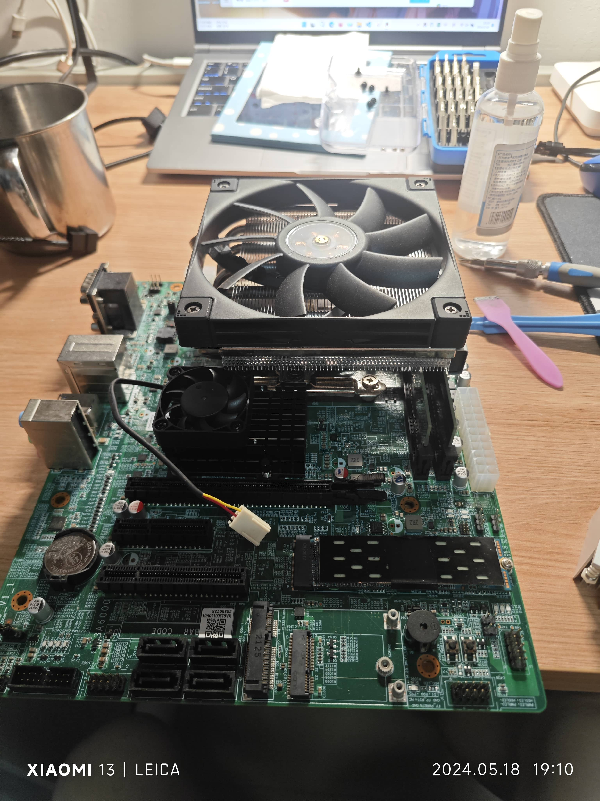

# 7A2000 桥片散热改装

**注意：该改装仅适用于 XA61200/XA612A0 主板。**

**华硕 XC-LS3A6M 主板仅需加装风扇即可。**

**集特 GM9-3003 系列、龙梦版主板需自行测量孔距。**

## 散热安装

请寻找孔距为 40mm * 40mm，四胶钉固定的散热器，注意宽度不能大于约46mm，否则会干涉到第一条 PCIe 插槽和 CPU 散热器安装位，高度虽不限但需要考虑当前使用的散热器，若使用大尺寸下压散热器需注意高度不能高于约 35mm。

风扇需注意电压，若为 5V 可使用主板左上角 USB2.0 9针接口转风扇 4pin 接口供电，若为 12V 则需从主板 SYS_FAN (可使用1分多接口线) 或电源 SATA 15P、大4D (Molex) 接口转接为风扇 4pin 接口供电。

散热器样式如图：

安装后效果如图：

